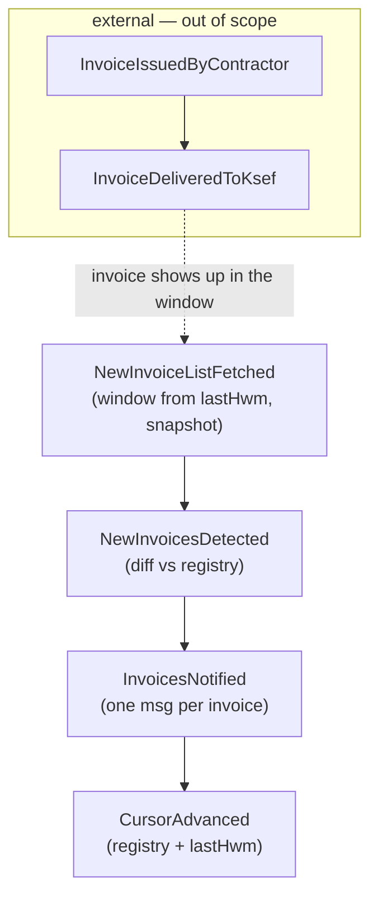

# Step 2a — Discover: Big Picture EventStorming

**Status:** ✅ reviewed & accepted (steps 1–7 pass)

Simplified big-picture pass: domain events (orange, past tense) on a rough timeline, with actors and loose areas. This is the simplified big picture requested for this phase — process-level detail follows in [02_discover_process_level.md](02_discover_process_level.md).

## Timeline of domain events

### Events

| Event | Meaning |
|-------|---------|
| `InvoiceDeliveredToKsef` | A contractor issued an invoice to the subject; KSeF accepted it. *(external event, happens in KSeF — the daemon never "sees" it directly)* |
| `NewInvoiceListFetched` | The simplified list (window `from = lastHwm → now`) was retrieved from KSeF for a subject. |
| `NewInvoicesDetected` | The fetched window was diffed against the notified-invoice registry; ≥ 1 unseen invoice reference found. |
| `InvoicesNotified` | Notifications for the detected invoices were delivered to the subject's channel (one message per invoice, I-22). |
| `CursorAdvanced` | The notified-invoice registry was updated and the subject's HWM cursor (`lastHwm`) moved forward — only once the whole fetched window was notified (I-23). |

### Commands & actors (big-picture level)

| Command | Actor |
|---------|-------|
| Poll subject (timer, per-subject offset A9) | Scheduler → Invoice Watching |
| Fetch invoice list (window parameter) | Invoice Watching → KSeF Access |
| Detect new invoices (diff window vs registry) | Invoice Watching |
| Send notification (one per invoice) | Invoice Watching → Notification Delivery |
| Advance cursor (registry + lastHwm) | Invoice Watching |

### Hot spots / questions carried forward

- How fresh is the KSeF simplified list vs the actual `InvoiceDeliveredToKsef`? (freshness delay budget — at 60-min default cadence, OQ-2 resolved; the API's `PermanentStorageHwmDate` gives an authoritative answer, OQ-5 resolved)
- What does KSeF report when a session is expired / credentials revoked? (failure handling)
- Does the simplified list guarantee stable ordering? → **Resolved:** ordering does not matter — detection is HWM-cursor window-fetch (date filter, snapshot mode) + registry-diff by ref (OQ-5 → I-23).

## Loose grouping → subdomain candidates

1. **KSeF interaction** — `NewInvoiceListFetched`, `SubjectPollFailed` (+ session/auth concerns).
2. **Invoice watching (detection)** — `NewInvoicesDetected`, `CursorAdvanced`.
3. **Notification delivery** — `InvoicesNotified` (+ channel abstraction).
4. **Subject configuration** — who to poll, how often, notify where (supports 1–3).

> Grouping is preliminary; boundaries argued in Step 3. `InvoiceDeliveredToKsef` stays out of scope — it belongs to KSeF's domain, not ours.