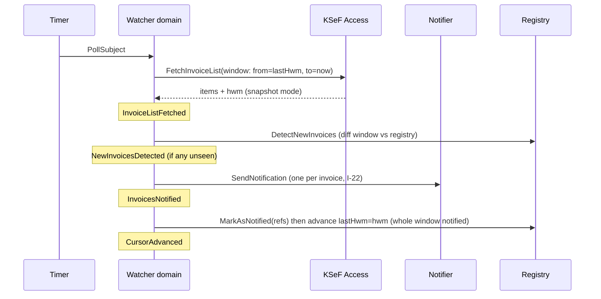

# Step 2b — Discover: Process Level (single flow)

**Status:** ✅ reviewed & accepted (steps 1–7 pass)

Zoom into the one end-to-end process of this system: **"notify about a newly received invoice"**. One flow, linear — the whole domain so far fits a single process-level storm.

## Process: New invoice → notification

### Walkthrough (commands → events → policies)

1. **Timer fires** (per-subject interval, offset A9) → command **`PollSubject`** to Invoice Watching (the orchestrator).
2. **`PollSubject`** → Watching commands KSeF Access: **`FetchInvoiceList(window: from=lastHwm, to=now)`** (snapshot mode, all pages until `HasMore = false`) → event **`InvoiceListFetched`**.
   - *External system:* KSeF API 2.0 (fresh session per fetch — A8; simplified invoice list).
   - *Failure branch:* KSeF unreachable/auth failure → `SubjectPollFailed` → log, retry next interval. Never advances the registry or `lastHwm`.
3. **Policy:** *"whenever `InvoiceListFetched`, diff it against the notified-invoice registry"* → command **`DetectNewInvoices`**.
   - *Read model:* already-notified invoice references per subject (the registry).
   - → event **`NewInvoicesDetected`** (with the full set of unseen references) — or nothing new; cycle ends silently.
4. **Policy:** *"whenever `NewInvoicesDetected`, notify the subject's channel"* → command **`SendNotification`** (one message per invoice, I-22).
   - Message payload: only what the simplified list returns — KSeF reference number, issuer invoice number, gross amount, issuer NIP (+ issuer name iff the list provides it). No per-invoice enrichment calls (OQ-1, resolved).
   - *External system:* messenger API/webhook (Discord first).
   - *Failure branch:* messenger down → hybrid retry (OQ-17: option c) — in-cycle backoff 5s→20s→60s (max 3 attempts), then cycle ends; the next poll re-plans the same window, which is the unbounded, restart-proof retry (PG-2). Registry and `lastHwm` **not** advanced until success — never mark-as-notified on failure (OQ-4, resolved).
   - → event **`InvoicesNotified`**.
5. **Policy:** *"whenever `InvoicesNotified`, remember those invoices as notified"* → command **`AdvanceCursor`** *(refined in Step 8 into two tactical commands, `MarkNotified` + `AdvanceHwm` — see `08_invoice_watching_aggregates.md`)* → event **`CursorAdvanced`**: refs marked in the registry, and only when *every* ref of the window is notified does `lastHwm` advance to the fetch's `hwm` (I-23). Catch-up after downtime is exactly steps 2–5 running over a wider window (`lastHwm` persisted across the downtime) — same code path, no special mode.

## Hot spots

| # | Hot spot | Carried to |
|---|----------|------------|
| HS-1 | Ordering/paging semantics of the KSeF simplified list — what defines "the newest" and can the list shift under our feet? → **Resolved:** the API supports date-range filtering + pagination with `HasMore` + `PermanentStorageHwmDate` as an authoritative committed-data boundary (verified in official C# client); detection = HWM-cursor window-fetch + registry-diff (OQ-5 → I-23). | closed (decision) |
| HS-2 | KSeF session lifecycle: session expiry mid-poll, credential rotation. | `07_define_ksef_access.md` |
| HS-3 | Duplicate notifications on restart-after-crash (send happened, cursor not advanced). Accepted by PG-2 / A4. | `07_define_notification_delivery.md` |
| HS-3b | Reverse risk: crash after send before cursor advance is the *only* duplicate window; a crash before send loses nothing (cursor not moved). Ordering: **send first, mark later**. | Design note (Step 9) |
| HS-4 | Notification batching: one message per invoice vs one digest per poll cycle. → **Resolved:** one message per invoice, always — no digest mode (OQ-6). | closed (decision) |
| HS-5 | Does "simplified list" contain contractor name? → **Resolved:** we use only simplified-list fields; per-invoice calls are out of the product boundary (OQ-1/OQ-10). | closed (decision) |