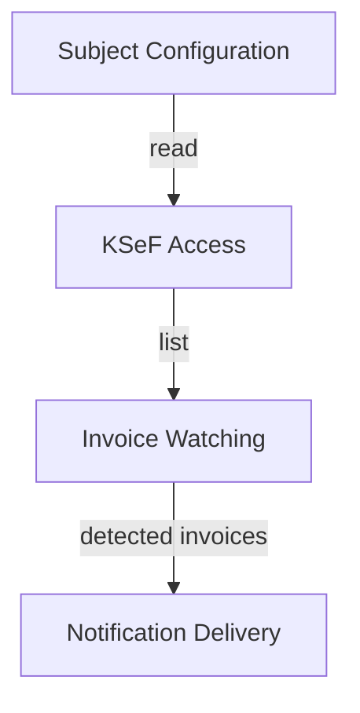

# Step 3 — Decompose: Subdomain candidates

**Status:** ⏳ drafted

Grouping the big-picture events into subdomain candidates and arguing each seam. Small domain, so only three candidates plus a supporting concern.

## Candidates

### 1. Invoice Watching *(core candidate)*

- **Events:** `NewInvoicesDetected`, `CursorAdvanced`; consumes `NewInvoiceListFetched`.
- **Responsibility:** decide *what is new* for a subject — fetch by HWM-cursor date window (snapshot mode), diff against the notified-invoice registry, own the cursor semantics (HS-1 closed, OQ-5 resolved → I-23).
- **Why a seam:** this is the part that carries the product's correctness guarantee ("never miss an invoice, PG-2"). Everything else can be replaced; if this logic is wrong, the product is worthless. It has its own language: *cursor, notified reference, detection, catch-up*.

### 2. KSeF Access *(supporting)*

- **Events:** `NewInvoiceListFetched`, `SubjectPollFailed`.
- **Responsibility:** all conversation with KSeF API 2.0 — authentication/session lifecycle (HS-2), retrieving the simplified list, translating KSeF's payload into the watcher's internal shape.
- **Why a seam:** KSeF is an external, government-owned system with its own release cadence, error taxonomy and payload language (`numer KSeF`, session tokens). Isolating it protects the rest from its churn; it is a classic ACL candidate (formalized in Step 7).

### 3. Notification Delivery *(supporting, extensible)*

- **Events:** `InvoicesNotified`.
- **Responsibility:** deliver a notification payload to a subject's channel via the configured notifier (Discord first), with retry semantics.
- **Why a seam:** the `Notifier` interface is by definition pluggable (PG-4) — new messengers must not touch watching logic. Messengers have their own failure modes (rate limits, outages — retry-with-backoff per OQ-4, resolved) unrelated to KSeF.

### Supporting concern (not a subdomain): Subject Configuration

- **Events:** `ConfigurationReloaded`, `SubjectOnboarded` *(introduced by the hot-reload decision — see `07_define_subject_configuration.md`)*; otherwise consumed as read data by all three above.
- **Responsibility:** the config file defining subjects (NIP, credentials, interval, channels), plus watching that file and republishing validated configuration on change (hot reload).
- **Why not a subdomain:** no domain behaviour of its own; its events are plumbing notifications ("config changed"), not business events. It is *shared read-side input*. It still deserves its own bounded context in Step 7 (configuration language and validation), but as a thin, generic one — the seam here is ownership of language ("subject", "channel", "interval"), not business rules.

## What is deliberately *not* modelled

- **Invoice processing/bookkeeping** (parsing FA(3), booking, payments) — explicitly out of scope (A1); KSeF's own domain. Noting this prevents later scope creep.
- **Invoice issuing** — belongs to contractors, not the subject watching its inbox.

## First-pass context relationships (rough)

Refined with patterns in Step 7 (`07_define_context_map.md`).