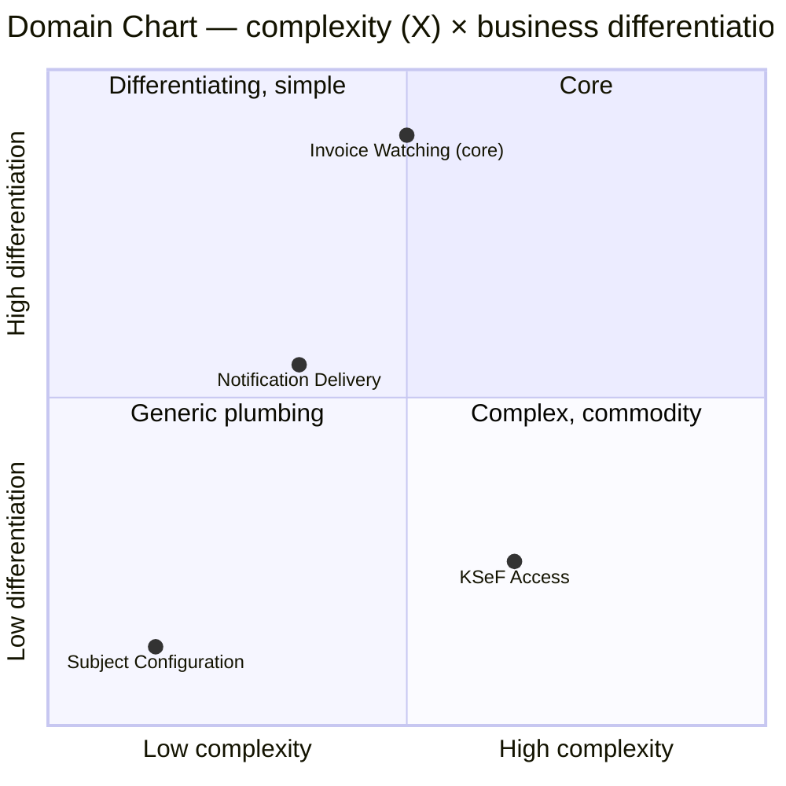

# Step 4 — Strategize: Core Domain Chart

**Status:** ⏳ drafted

## Chart (complexity × differentiation)

| | Complexity | Differentiation | Classification |
|---|---|---|---|
| ★ Invoice Watching | medium (cursor/diff correctness, catch-up, at-least-once) | **high** — the very reason the product exists | **Core** |
| ● KSeF Access | medium-high (session lifecycle, API churn) | low — anyone can call KSeF; value is in calling it *correctly and durably*, not differently | **Supporting** |
| ◆ Notification Delivery | low-medium (retry, channel quirks) | medium — many notifiers is a visible feature, but each is shallow | **Supporting** (extensible by design, PG-4) |
| ▲ Subject Configuration | low | low | **Generic** |

## Justification & consequences

- **Invoice Watching is the Core.** It is the only place where being wrong destroys the product's promise (PG-2: never lose a notification). It gets the most modelling care (Step 8 first), the clearest tests, and the strictest protection from KSeF/messenger churn. Note its complexity is *modest* — this is a small system, and the core is correspondingly small; "core" here means "where correctness lives", not "where most code lives".
- **KSeF Access is Supporting, not Generic.** No buy-vs-build choice exists (the API is what it is), but it carries real integration complexity (HS-2). Invest in robustness, not in clever modelling; keep it behind an ACL so API churn never leaks inside.
- **Notification Delivery is Supporting with a pluggable seam.** Each concrete notifier (Discord, …) is close to generic plumbing, but the `Notifier` abstraction itself is a deliberate product decision (PG-4) — treat the interface as stable, implementations as cheap.
- **Subject Configuration is Generic plumbing.** A file format plus validation; never let it grow domain logic.

## Implication for next steps

Step 8 (Code), when we get there, starts with **Invoice Watching**'s aggregate(s) — not with KSeF integration, tempting as that is to build first. Steps 5–7 treat all four contexts but keep this priority order in mind.