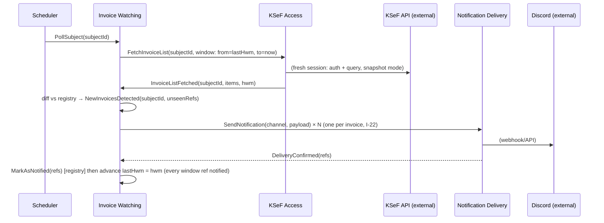
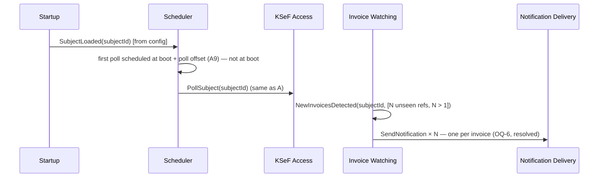
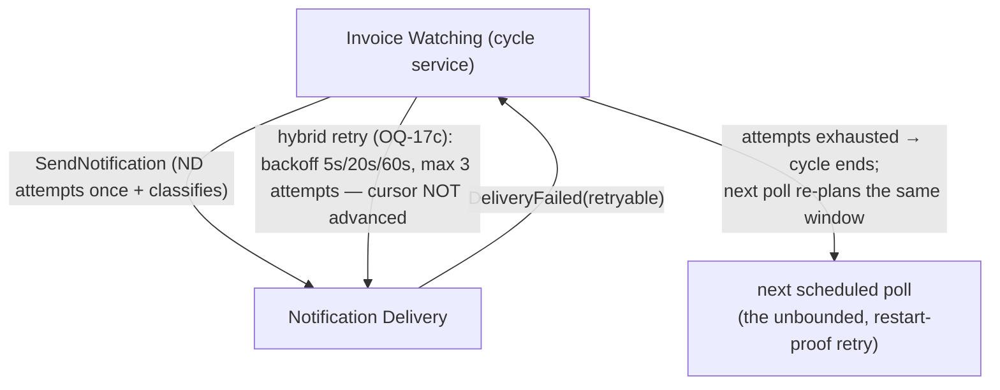
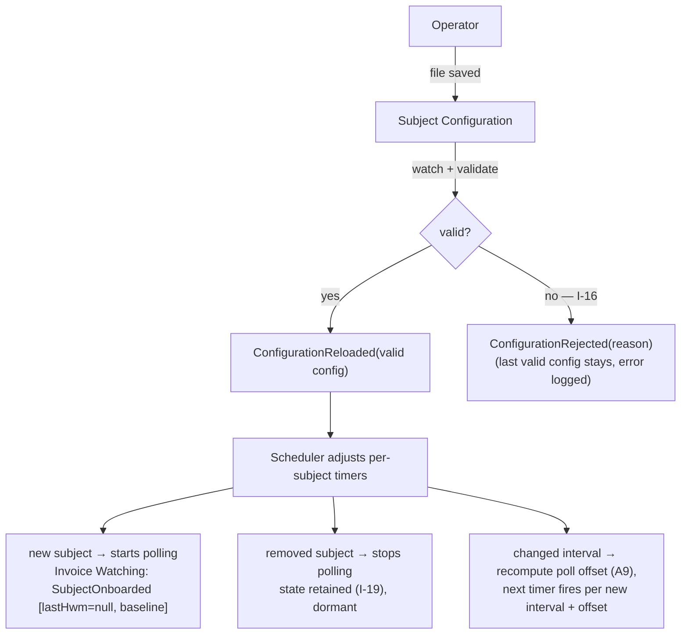

# Step 5 — Connect: Domain Message Flows

**Status:** ✅ reviewed & accepted (steps 1–7 pass)

Two scenarios flow across context boundaries. Same four contexts as Step 3/4: **Subject Configuration**, **KSeF Access**, **Invoice Watching**, **Notification Delivery**.

## Scenario A: New invoice detected & notified (happy path)

Actor initiating: *Daemon scheduler (per-subject timer)*

**Narration.** The timer fires per subject and commands **Invoice Watching** (`PollSubject`) — Watching is the orchestrator of the cycle. It commands KSeF Access (`FetchInvoiceList`) with **the window passed explicitly** (`from = lastHwm`, `to = now`) — the window is Watching's own state, so KSeF Access never reads the registry or HWM. KSeF Access opens a fresh session, queries in snapshot mode, and returns the ACL-translated `InvoiceListFetched` — items **plus the fetched `hwm`** (translated `PermanentStorageHwmDate`). Invoice Watching diffs against its own registry; if there are unseen references, it emits `NewInvoicesDetected` and commands Notification Delivery to send (one message per invoice, I-22). **Only after** `DeliveryConfirmed` does Watching mark references as notified — and **only once every ref from the window is notified** does it advance `lastHwm = hwm` (send-before-mark applies to the HWM cursor as well: advancing it right after fetch would let a crash between fetch and send permanently skip a detected-but-unsent invoice — HS-3b, I-23). KSeF Access and Notification Delivery are executors of single commands; Invoice Watching orchestrates.

**Replication vs live-read check (per skill's lesson):**
- Watching never live-queries KSeF mid-decision. Its *decision input* (the fetched list) is a snapshot handed over the boundary; its *decision rule input* (already-notified refs) is its own local registry; the fetch window is passed as a parameter, not read from anyone else's state. ✅ No cross-context live-read feeds a domain decision.
- Notification Delivery receives everything it needs in the payload (no query back into Watching). ✅
- Interval, channel config etc. are read-side parameter lookups of current configuration — live-read of Subject Configuration is fine (a parameter, not a domain decision guard; detection is driven solely by Watching's own registry + HWM). Hot reload (Scenario D) changes parameter values between cycles but never affects this conclusion.

## Scenario B: Catch-up after downtime

Actor initiating: *Daemon startup*

**Narration.** Catch-up is *not a special mode*: after restart the registry persists (A3), so the very first poll naturally diffs against pre-downtime state and emits a larger `NewInvoicesDetected` batch. Notification form is decided: **one message per invoice, always** — including catch-up batches (OQ-6, resolved); no digest mode, no aggregation logic (HS-4 closed). This is a deliberate consequence of the minimal-state choice (A3) — cursor semantics must survive restarts, which constrains Step 8's persistence choice.

## Scenario C (failure branch, worth a flow): Discord down

**Narration.** Cursor stays put, so a crash between "sent" and "marked" causes at most one duplicate — never a loss (PG-2, A4). Delivery retry is **hybrid** (OQ-17, resolved: option c): ND attempts once and classifies; the cycle service retries with backoff (5s → 20s → 60s, max 3 attempts — catching momentary hiccups within seconds); if exhausted, the cycle ends with no state change and the *next scheduled poll* re-plans the same `lastHwm`-anchored window — the unbounded, restart-proof retry is emergent from the HWM cursor (a dead in-memory loop never loses the guarantee). Never mark-as-notified on failure (OQ-4, resolved). The poll cycle for *other* subjects is unaffected (per-subject isolation).

## Scenario D: Config hot-reloaded (subject added / removed / changed)

Actor initiating: *Operator saves the config file*

**Narration.** The daemon watches the config file; on change it validates and, if valid, republishes the configuration — no restart. Validation includes the **per-subject minimum interval (I-13a: ≥ 15 min, MF recommendation)**: a file with any subject below the bound is *invalid* — rejected here and refused at startup. There is **no global fleet cap** — KSeF counts limits per (context + IP) pair, so each subject brings its own budget (I-21). A **newly added subject** has no state (`lastHwm = null`, empty registry), so its first poll establishes the **baseline** (I-18): one narrow fetch, no notifications sent, `lastHwm` set — only invoices arriving after onboarding are notified. A **removed subject** stops being polled but its state (registry + `lastHwm`) is retained (dormant), so re-adding the subject resumes watching without a historical flood (and baseline does not re-run — the state is non-empty). A changed interval takes effect from the next poll, with the poll offset recomputed (A9 — offset depends on the interval). Invalid file ⇒ keep last valid config, log loudly (I-16; fail-fast I-13 applies only at startup).

## Open questions (new)

- **OQ-7a** Watchdog heartbeat (operator's idea, candidate mechanism for the "silent daemon" risk): e.g. once a day a message *"no new invoices"* to the channel — the *absence* of the heartbeat is then a signal that the daemon or channel is broken (inverted liveness check; a dead system cannot announce its own death, but a *missing* expected heartbeat can be noticed). Open: does this replace or complement permanent-failure escalation (OQ-7b)? What is the heartbeat cadence and wording? Is it per subject, per daemon, or both?
- **OQ-7b** Permanent channel failure (webhook revoked): how does the operator learn about it? Options: logs only (V1 default) vs operator fallback channel. Watch-out: this alerting path can itself fail — a heartbeat (OQ-7a) is self-checking in a way a failure alert is not.