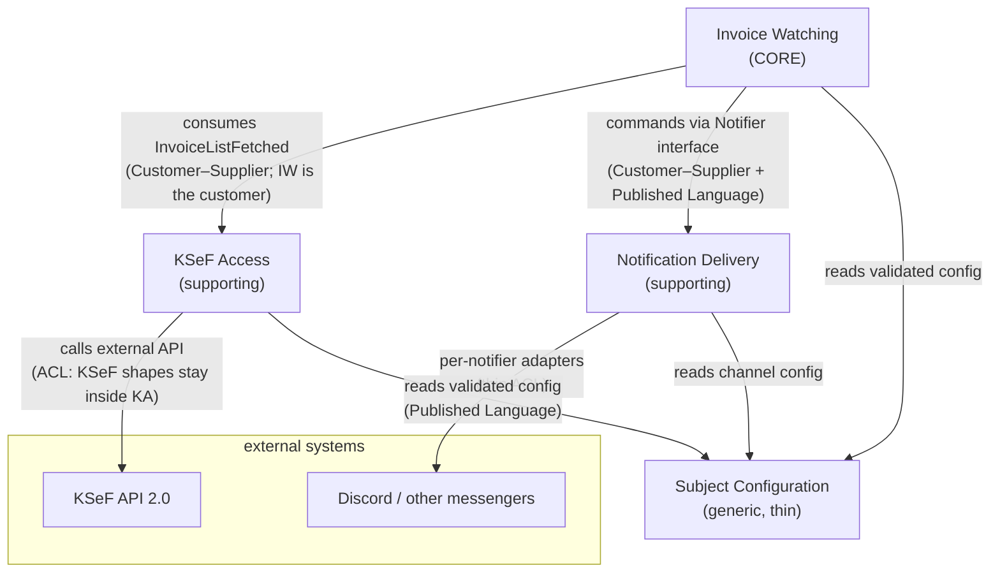

# Step 7a — Define: Context Map

**Status:** ⏳ drafted

## Diagram

Arrow semantics: **`A --> B` = "A depends on B"** (tail is the dependent, head is the dependency). This is a *structural* dependency map, not a runtime message flow — runtime replies (e.g. `DeliveryConfirmed`) travel back as messages *within* an interaction and are not separate dependencies.

One structural edge per pair (per "no cycles in structural diagrams" lesson). The runtime reply `DeliveryConfirmed / DeliveryFailed` (ND → IW) is a message *inside* the send interaction — not a reverse dependency, hence no second arrow (its absence was intended; an earlier Mermaid conversion accidentally drew it as an edge, creating a visible cycle — fixed).

## Relationships & patterns

| Relationship | Pattern | Contract |
|---|---|---|
| Subject Configuration → all | **Published Language** (config file schema) | Consumers read-only; validated at load **and on every hot reload** (OQ-3, resolved); invalid reload keeps last valid config (I-16). |
| KSeF (external) → KSeF Access | **ACL** (anti-corruption layer) | KSeF payload shapes, session semantics and error taxonomy are translated at this boundary; nothing KSeF-shaped crosses inward. |
| KSeF Access → Invoice Watching | **Customer–Supplier** (Watching is the customer) | Contract: `FetchInvoiceList(subject, window{from=lastHwm, to=now})` → `InvoiceListFetched(subject, items[refNo, invoiceNo, grossAmount, issuerNip, issuerName?], hwm)` — the simplified list defines the surface; no per-invoice enrichment (OQ-1/OQ-10, resolved). Watching owns the window and cursor; Access executes and passes `hwm` through. |
| Invoice Watching → Notification Delivery | **Customer–Supplier** + **Published Language** (the `Notifier` interface) | Contract: `send(subjectChannel, NotificationPayload)` + delivery result. Watching never learns channel specifics. |
| Notification Delivery → messengers | ACL per notifier (thin) | Each notifier implementation isolates its API quirks. |

**Model translation at the boundaries:** KSeF's "faktura otrzymana / numer KSeF" becomes the watcher-internal *invoice reference*; the notifier payload renders it as message text. The same invoice has three representations (KSeF JSON → watcher's `InvoiceListItem` → Discord message) and each is owned by its context — no shared invoice model across contexts (no accidental Shared Kernel).

## Context ownership summary

| Context | Owns | Classification |
|---|---|---|
| Invoice Watching | detection decision, cursor/registry, catch-up semantics | **Core** |
| KSeF Access | sessions, simplified-list retrieval, KSeF translation | Supporting |
| Notification Delivery | `Notifier` interface, per-channel adapters, retry/delivery result | Supporting |
| Subject Configuration | config file schema + validation, subject/channel language | Generic |

Per-context canvases: [07_define_invoice_watching.md](07_define_invoice_watching.md) · [07_define_ksef_access.md](07_define_ksef_access.md) · [07_define_notification_delivery.md](07_define_notification_delivery.md) · [07_define_subject_configuration.md](07_define_subject_configuration.md)