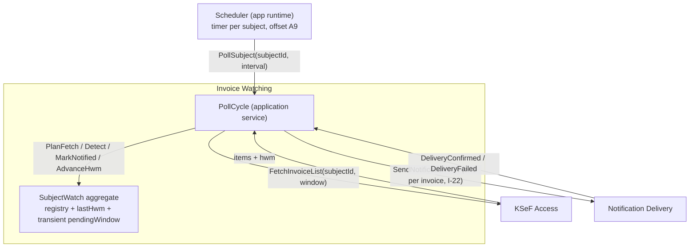

# Step 8a — Code: Invoice Watching — Domain Model (overview)

**Status:** ✅ reviewed & accepted

Tactical model of the Core Domain. The context's job (decided in Step 7): decide what is new per subject, orchestrate the poll cycle, own the cursor — never miss an invoice (PG-2).

## Inventory

| Building block | Name | Notes |
|---|---|---|
| **Aggregate** | `SubjectWatch` (one per subject) | The whole persistent state of the context — see [08_invoice_watching_aggregates.md](08_invoice_watching_aggregates.md) |
| **Value objects** | `SubjectId`, `InvoiceReference`, `Hwm`, `FetchWindow`, `DetectedInvoice` | See [08_invoice_watching_value_objects.md](08_invoice_watching_value_objects.md) |
| **Domain services (ports)** | `IInvoiceListProvider`, `INotifier` + `PollCycle` orchestration | See [08_invoice_watching_domain_services.md](08_invoice_watching_domain_services.md) |
| **Domain events** | `SubjectOnboarded`, `NewInvoicesDetected`, `InvoicesNotified`, `CursorAdvanced` | Raised by the aggregate; stay inside the context (catalog below) |

## Runtime interaction sketch (calls, not the structural dependency map)

## Deliberate absences (justified, per working agreement)

- **Entities — none.** The registry is a set of `InvoiceReference` value objects inside the aggregate; registry entries have no lifecycle or behavior of their own (they are only "present" or "not yet present"). Nothing else in this context has an identity.
- **Read models — none.** Detection queries the aggregate's own state (`notifiedRefs`) — consistent with the invariants (I-1/I-23 must see exactly the same state that commands mutate), so no separate projection is warranted. If a future fleet size makes loading the full registry per poll expensive, revisit (Step 9 persistence may keep the set queryable without full loads).
- **Integration events — none.** Single-process deployment: cross-context communication is in-process Customer–Supplier contracts (direct calls with owned, versioned payload shapes — `FetchInvoiceList`, `SendNotification`), not published events. Domain events stay *inside* Invoice Watching; nothing KSeF-shaped or Discord-shaped leaks across boundaries. This is a conscious application of the domain-event-≠-integration-event lesson to a monolith: the *contracts* play the integration role.

## Domain events catalog (inside the context)

| Event | Raised when | Payload |
|---|---|---|
| `SubjectOnboarded` | baseline confirmed for a subject with no prior state (I-18) | `subjectId`, `baselineHwm` |
| `NewInvoicesDetected` | a fetched window contains refs not present in the registry | `subjectId`, `unseenRefs` |
| `InvoicesNotified` | delivery confirmed for a batch of refs (raised incrementally per confirmed ref) | `subjectId`, `confirmedRefs` |
| `CursorAdvanced` | `lastHwm` advanced (whole window notified, I-23) | `subjectId`, `lastHwm` |

`SubjectPollFailed` belongs to KSeF Access (its canvas), not here — a failed fetch ends the cycle with no state change.

## Open question (new)

- **OQ-16** *Resolved.* The payload carries **both** `NetAmount` and `GrossAmount`, plus `Currency` (all from the simplified list — within the OQ-1 data surface; amounts without currency are ambiguous on foreign-currency invoices). Which amount is **displayed** is a **per-subject config setting** (`amountDisplay: brutto | netto`, default `brutto`), consumed by Notification Delivery at render time — the payload itself stays presentation-agnostic (I-12). Rendering rule (operator's decision): the message contains **only factual invoice info and the amount** — no advisory/action texts ("pay today…").