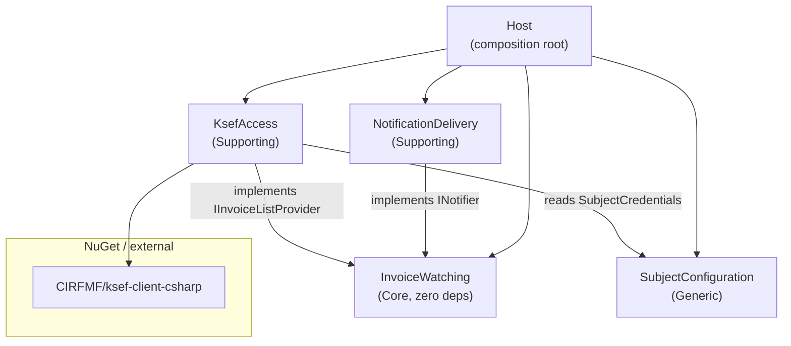

# Step 9 — Architecture

**Status:** ✅ reviewed & accepted

Translates the Step 8 tactical model into an implementation structure: Clean Architecture layering, dependency rule pointed inward, and the concrete deployment shape. Most of the "distributed system" decisions this step normally forces (broker choice, outbox/inbox, integration-event schemas) don't apply here — Step 8 already settled the deployment as a **single-process monolith with in-process Customer–Supplier contracts, no integration events**. This step's job is to formalize *that*, plus the genuinely open questions: persistence, project structure, boundary enforcement, and scheduling.

## Deployment style

**Single OS process** (a systemd daemon, A6): one .NET process hosts all four bounded contexts and serves all configured subjects. No distributed monolith, no microservices — there is exactly one deployable artifact. Consequence: cross-context communication is **in-process method calls against C#-typed interfaces**, never HTTP/queue/broker between contexts (already decided in `08_invoice_watching_domain_model.md`'s "deliberate absences: integration events — none"). This section makes that deployment shape explicit rather than implicit.

## Solution / project structure

One .NET solution, **one class-library project per bounded context** (decision: compiler-enforced boundaries over convention — matches Step 6's acceptance criterion that a contributor touching one context cannot accidentally reach into another). A thin executable project is the composition root.

```text
KsefWatcher.sln
├── src/
│   ├── KsefWatcher.InvoiceWatching/        # Core. Zero external NuGet deps beyond BCL/logging-abstractions.
│   │   ├── Domain/                         # SubjectWatch, value objects (08b/08c)
│   │   ├── Application/                    # PollCycle (08d)
│   │   └── Ports/                          # IInvoiceListProvider, INotifier, ISubjectWatchRepository
│   │                                       # + the Published-Language types their signatures use:
│   │                                       # DetectedInvoice, FetchWindow, Hwm, ChannelRef,
│   │                                       # AmountDisplay, DeliveryResult (see "Clarifications" below)
│   │
│   ├── KsefWatcher.KsefAccess/              # Supporting. References InvoiceWatching (implements
│   │   │                                    # IInvoiceListProvider) + SubjectConfiguration (reads
│   │   │                                    # credentials) + NuGet CIRFMF/ksef-client-csharp.
│   │   ├── KsefAccessService.cs             # implements IInvoiceListProvider (08e)
│   │   └── KsefClientAdapter.cs             # the only file touching client-library types (ACL)
│   │
│   ├── KsefWatcher.NotificationDelivery/    # Supporting. References InvoiceWatching only
│   │   │                                    # (implements INotifier) — no Subject Configuration
│   │   │                                    # reference (see "Clarifications" below).
│   │   ├── DeliveryService.cs               # implements INotifier (08f)
│   │   └── Notifiers/DiscordNotifier.cs
│   │
│   ├── KsefWatcher.SubjectConfiguration/    # Generic. References nothing project-internal.
│   │   ├── ConfigFile.cs, SubjectConfig.cs, ChannelConfig.cs   # schema (08g)
│   │   ├── ConfigValidator.cs                                   # I-13/I-13a/I-14/I-15
│   │   └── ConfigWatcher.cs                                     # hot reload (I-16/I-17)
│   │
│   └── KsefWatcher.Host/                    # Composition root. References all four.
│       ├── Program.cs                       # DI wiring
│       ├── PollingBackgroundService.cs      # per-subject timers → PollCycle.Run(...)
│       ├── ConfigReloadCoordinator.cs       # wires ConfigWatcher → timer add/remove/reschedule
│       ├── HeartbeatScheduler.cs            # daily per-subject pulse (OQ-7a/7b)
│       └── Persistence/SqliteSubjectWatchRepository.cs   # implements ISubjectWatchRepository
│
└── tests/
    ├── KsefWatcher.InvoiceWatching.Tests/   # SubjectWatch + PollCycle against fakes — no KSeF
    │                                        # sandbox, no Discord webhook (Step 6's payoff)
    ├── KsefWatcher.KsefAccess.Tests/
    └── KsefWatcher.NotificationDelivery.Tests/
```

### Dependency graph

Same convention as `07_define_context_map.md`: **`A --> B` = "A depends on B"**.



`InvoiceWatching` has **no outgoing edges** — it is the only project that can be built and unit-tested with zero infrastructure, matching the Step 6 acceptance criteria verbatim. `NotificationDelivery` has no edge to `SubjectConfiguration` (see Clarifications). No cycles.

## Boundary enforcement

**Project references only** — no architecture-test library (e.g. NetArchTest), no CI lint step. At this scale, four `.csproj` files with a directed, acyclic reference graph *is* the enforcement mechanism: the C# compiler physically cannot let `InvoiceWatching` see a KSeF- or Discord-shaped type, because it has no reference to those assemblies. Revisit only if the project ever grows enough contexts/contributors that reference-graph discipline alone stops being self-evident from `.sln` structure.

## Persistence

**SQLite** (`Microsoft.Data.Sqlite`), one file `state.db` next to `config.yaml`.

Rationale, weighed against the alternatives for this specific requirement (Save must be atomic across `notifiedRefs` + `lastHwm`, per I-4/I-23):

- **Plain files** (JSON/text) would need a hand-rolled atomic-write dance (temp file + fsync + rename + directory fsync) to get the same guarantee `SqliteConnection.BeginTransaction()` gives for free — more custom code, more crash-edge-cases to get right, for a *correctness-critical* invariant (I-1: no loss). Simplicity favors *fewer bugs*, not *fewer dependencies*, when the two trade off.
- **LiteDB** is a reasonable alternative but adds a less-ubiquitous dependency for no benefit over SQLite at this data shape (two tiny tables, no document nesting).
- SQLite still keeps the **"single binary feel"** (Project Values, `01_understand.md`): no server process, one file, and it stays trivially inspectable/backup-able with the standard `sqlite3` CLI — which also serves the **Openness** value (an operator can audit state without touching code).

Schema (indicative):

```sql
CREATE TABLE subject_state (
    subject_id     TEXT PRIMARY KEY,   -- SubjectId.Nip
    last_hwm_utc   TEXT NULL           -- ISO-8601 UTC; NULL = not onboarded yet (I-18)
);

CREATE TABLE notified_refs (
    subject_id     TEXT NOT NULL,
    ksef_number    TEXT NOT NULL,      -- InvoiceReference.KsefNumber
    PRIMARY KEY (subject_id, ksef_number)
);
```

- `Load(subjectId)`: one `SELECT` for `last_hwm_utc` + one `SELECT` for the full `notified_refs` set (I-5: append-only, no deletes — the registry is small enough per subject, per OQ-8, to load whole).
- `Save(subject)`: one transaction — `INSERT OR IGNORE` new rows into `notified_refs` (idempotent re-marking, per `08_invoice_watching_aggregates.md`'s consistency-boundaries note) + `UPDATE subject_state SET last_hwm_utc = ...`. `pendingWindow` is never written (transient by design, 08b).
- No WAL tuning, no connection pooling: single process, single writer, one `SubjectWatch` in flight per subject (08b's single-flight guard) — the simplest ADO.NET usage is sufficient. Subject Configuration's own schema (YAML) is unrelated and unaffected.

## Scheduler

**`BackgroundService` (`IHostedService`)** in `KsefWatcher.Host`, one per-subject `PeriodicTimer` (or `System.Threading.Timer`), not an external job library (Quartz.NET etc. would add persistence/clustering machinery this single-daemon, single-process product has no use for).

- Each subject's timer fires at `boot + offset` then every `interval` (A9: `offset = hash(NIP) mod interval`), calling `PollCycle.Run(subjectId, channel, amountDisplay, provider, notifier)` (08d) with `channel`/`amountDisplay` resolved from the current config snapshot at call time (not cached inside `PollCycle` — Subject Configuration is read-side, Step 5).
- `ConfigReloadCoordinator` subscribes to `SubjectConfiguration`'s file-watch event (I-16/I-17): on a valid reload it diffs the subject list against currently-running timers — new subject → start timer (baseline path, I-18); removed subject → stop timer **and** delete its `state.db` rows (I-19, the deliberate reset); changed interval → recompute offset (A9) and reschedule.
- `HeartbeatScheduler` is a second, much coarser per-subject timer (fires once daily at a time derived from the same poll offset, OQ-7a/7b) that calls the same `INotifier` port directly with a heartbeat payload — it is a second *caller* of the port, not a change to Notification Delivery's tactical model (already noted in `08_notification_delivery_tactical_model.md`).
- Per-subject isolation (I-3): each timer callback is independent; an unhandled exception in one subject's `PollCycle.Run` must not stop other subjects' timers or the host — caught and logged at the `BackgroundService` boundary, not inside `PollCycle`.

## Logging

Structured logging via `Microsoft.Extensions.Logging`, written to stdout — captured by `systemd`/`journalctl` under the daemon's unit (A6, no separate log-shipping infrastructure needed for a self-hosted single-operator tool). The specific "loud" logs mandated by earlier invariants become `LogWarning`/`LogError` calls at these exact points, so they're greppable by invariant:

| Invariant | Log level | Where |
|---|---|---|
| I-8 `SubjectPollFailed` | Warning (RateLimited/Network) · Error (AuthFailure, ApiError) | `KsefAccessService` catch/classify path |
| I-11 permanent delivery failure | Error | `DeliveryService` classification → `Failed(Permanent)` |
| I-16 invalid config on reload | Error | `ConfigWatcher` validation failure |
| OQ-18 auth failure (recurring) | Error, every poll (I-19: no hidden stop-state) | same as I-8's `AuthFailure` case |
| I-14 credentials never logged | *(negative requirement)* | enforced by never passing `SubjectCredentials`/token fields to any logger — code-review discipline, not tooling, at this scale |

## Cross-context communication (recap — nothing new)

Reconfirms `08_invoice_watching_domain_model.md`: contexts call each other in-process through the typed ports (`IInvoiceListProvider`, `INotifier`, `ISubjectWatchRepository`); no outbox pattern, no inbox/idempotent-consumer, no message broker — these solve *dual-write* and *at-least-once delivery across a process boundary*, and there is no process boundary here. If a future version ever splits contexts into separate processes, this section is exactly what would need to be redesigned first (revisit then, not speculatively now — Simplicity).

## Clarifications to earlier steps (surfaced by this step)

Per the working agreement ("later steps may reopen earlier ones"), drafting this step's project graph forced two small, concrete fixes to already-accepted Step 7 documents (applied directly, not just noted here):

1. **`07_define_notification_delivery.md`** said Notification Delivery is "owner of the `Notifier` interface." `08_invoice_watching_domain_services.md` already, unambiguously, treats `INotifier` as a port **owned by Invoice Watching** ("implemented elsewhere"). Fixed the wording to "implementer," and correspondingly this architecture places the `INotifier` interface — and its signature types `ChannelRef`, `AmountDisplay`, `DeliveryResult` — in `KsefWatcher.InvoiceWatching/Ports/`, not in `NotificationDelivery`. This is what keeps the dependency arrow pointing `NotificationDelivery → InvoiceWatching` (adapter depends on core) rather than the reverse, which is what Step 6's testability criterion actually requires structurally, not just as an aspiration.
2. **`07_define_notification_delivery.md`**'s inbound table listed Subject Configuration as a direct input to Notification Delivery. Step 8's concrete `ChannelRef` shape already carries its resolved target (e.g. the webhook URL) — so that resolution happens once, in the Host/scheduler layer, and Notification Delivery needs no project reference to Subject Configuration. Fixed the table row accordingly.

## Open questions

None new. `09_integration_contracts.md` covers the (deliberately thin) external-system contract surface.
